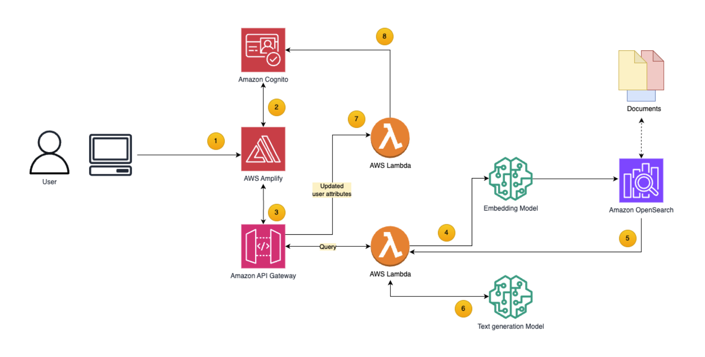
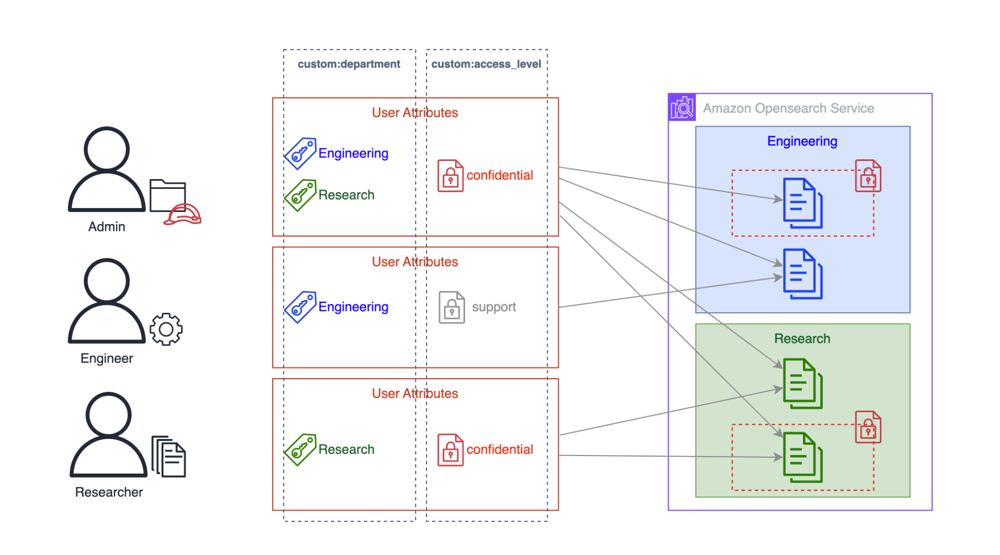

# Manage access controls in GenAI-powered search applications using Amazon OpenSearch and AWS Cognito
This code sample illustrates how to build a document searching RAG solutions that ensure that only authorized users can access and interact with specific documents based on their roles, departments, and other relevant attributes. It combines Amazon Opensearch Service and Amazon Cognito custom attributes to make a tag based access control mechanism that makes it simple to manage at scale. 




## Pre-requisites
Before installing this sample, make sure you have following installed:

1. [AWS CLI](https://aws.amazon.com/cli/)  
2. [Docker](https://docs.docker.com/get-docker/) 
3. [NodeJS](https://nodejs.org/en/) 
4. [AWS CDK v2](https://docs.aws.amazon.com/cdk/v2/guide/getting_started.html#getting_started_install) 
5. [Configure your AWS CLI](https://docs.aws.amazon.com/cli/latest/userguide/cli-configure-quickstart.html) 
6. [Bootstrap AWS CDK in your target account](https://docs.aws.amazon.com/cdk/v2/guide/getting_started.html#getting_started_bootstrap) 

## Deploy the AWS resources:
We will use AWS CDK to deploy the architecture described above. CDK allows defining the Infrastructure through a familiar programming language such as Python

1. Clone the repo from Github:

```
git clone git@ssh.gitlab.aws.dev:opensearch-rag/rag-os-fgac.git # to be changed later
```

2. Adjust the AWS Region where the stack will be deployed in, by setting the following environment variable:

``` 
export AWS_REGION=<<Your region name>>
```

3. Use the command `make init` to create and activate a Python virtual environment and install the dependencies required for the deployment stack
4. Use the command `make bootstrap-cdk`  to bootstrap the AWS CDK:

```
> make bootstrap-cdk
⏳ Bootstrapping environment aws://<acct#>/<region>... 
Trusted accounts for deployment: (none) 
Trusted accounts for lookup: (none) 
Using default execution policy of 
'arn:aws:iam::aws:policy/AdministratorAccess'. 
Pass '--cloudformation-execution-policies' to 
customize. ✅ Environment aws://<acct#>/<region> 
bootstrapped (no changes).
```


5. Now use the command `make deploy-cdk` to deploy the whole stack to your AWS account

6. Start ingesting the mock data using the Data Ingestion Lambda. Navigate to the AWS Console → Lambda → RAGCdkStack-DataIngestionLambda-xyz. Create a Test Event and paste this [sample JSON](cdk-infrastructure/simple_rag_with_access_control/lambda/ingestion/sample_inputs/input.json) as an input. Then press on Test
    
7. Additionally, you can create mock users with different attributes attached to them with the command:
```
 make mock-users
```
This will create users with the following access pattern:



## Install frontend (in localhost)

1. Use the following command to run the frontend application locally
```
make install-run-frontend
```

## Install frontend (in Amplify hosting)

AWS Amplify Hosting enables a fully-managed deployment of the application's React frontend in an AWS-managed account using Amazon S3 and Amazon CloudFront. You can optionally run the React frontend locally by skipping to Deploy the application with AWS SAM.

To set up Amplify Hosting:

1. Fork this GitHub repository and take note of your repository URL, for example https://github.com/user/rag-os-fgac/.

2. Create a GitHub fine-grained access token for the new repository by following this guide. For the Repository permissions, select Read and write for Content and Webhooks.
https://docs.aws.amazon.com/amplify/latest/userguide/setting-up-GitHub-access.html#setting-up-github-app-cloudformation

Select the Plaintext tab and confirm your secret looks like this:
```
github_pat_T2wyo------------------------------------------------------------------------rs0Pp
```

3. Create a new secret called `FrontendGithubToken` in AWS Secrets Manager and input your fine-grained access token as plaintext. 

### Deploy the frontend.

1. Change directory to 
2. Open `deploy.sh` and put the github url as `FRONTEND_REPOSITORY` variable. It should be something like 'https://github.com/user/rag-os-fgac/'
3. Run `deploy.sh` to deploy cloudformation template.


## Cleanup
Run `make destroy` to cleanup all related resources in your account. 

## Security
This application was written for demonstration and educational purposes and not for production use. The [Security Pillar of the AWS Well-Architected Framework](https://docs.aws.amazon.com/wellarchitected/latest/security-pillar/welcome.html)
can support you in further adopting the sample into a production deployment in addition to your own established processes.

See [CONTRIBUTING](CONTRIBUTING.md#security-issue-notifications) for more information.


## License

This library is licensed under the MIT-0 License. See the LICENSE file.

**3rd party licences (see THIRD_PARTY_LICENSES):**  
This package depends on and may incorporate or retrieve a number of third-party
software packages (such as open source packages) at install-time or build-time
or run-time ("External Dependencies"). The External Dependencies are subject to
license terms that you must accept in order to use this package. If you do not
accept all of the applicable license terms, you should not use this package. We
recommend that you consult your company’s open source approval policy before
proceeding.

Provided below is a list of External Dependencies and the applicable license
identification as indicated by the documentation associated with the External
Dependencies as of Amazon's most recent review.

THIS INFORMATION IS PROVIDED FOR CONVENIENCE ONLY. AMAZON DOES NOT PROMISE THAT
THE LIST OR THE APPLICABLE TERMS AND CONDITIONS ARE COMPLETE, ACCURATE, OR
UP-TO-DATE, AND AMAZON WILL HAVE NO LIABILITY FOR ANY INACCURACIES. YOU SHOULD
CONSULT THE DOWNLOAD SITES FOR THE EXTERNAL DEPENDENCIES FOR THE MOST COMPLETE
AND UP-TO-DATE LICENSING INFORMATION.

YOUR USE OF THE EXTERNAL DEPENDENCIES IS AT YOUR SOLE RISK. IN NO EVENT WILL
AMAZON BE LIABLE FOR ANY DAMAGES, INCLUDING WITHOUT LIMITATION ANY DIRECT,
INDIRECT, CONSEQUENTIAL, SPECIAL, INCIDENTAL, OR PUNITIVE DAMAGES (INCLUDING
FOR ANY LOSS OF GOODWILL, BUSINESS INTERRUPTION, LOST PROFITS OR DATA, OR
COMPUTER FAILURE OR MALFUNCTION) ARISING FROM OR RELATING TO THE EXTERNAL
DEPENDENCIES, HOWEVER CAUSED AND REGARDLESS OF THE THEORY OF LIABILITY, EVEN
IF AMAZON HAS BEEN ADVISED OF THE POSSIBILITY OF SUCH DAMAGES. THESE LIMITATIONS
AND DISCLAIMERS APPLY EXCEPT TO THE EXTENT PROHIBITED BY APPLICABLE LAW.


## Contributing

Refer to [CONTRIBUTING](./CONTRIBUTING.md) for more details on how to contribute to this project.

